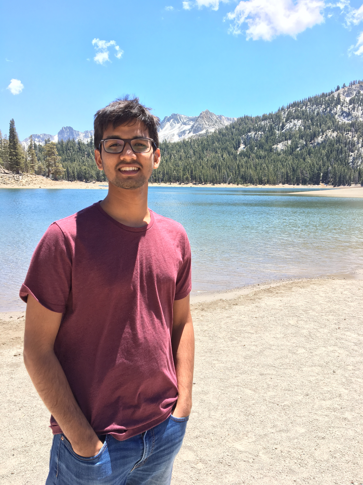

    
    <section>
        <h1>Hello  World!</h1>
        
        I am pursuing my Masters of Science in Computer Science at Georgia Institute of Technology, Atlanta with a focus in Machine Learning in Natural Language and Computer Vision. 
        Before joining Tech, I worked at BlueJeans Networks as a Senior Software Developer.
        
          I completed my Bachelors(Hons.) of Engineering in Computer Science and Masters(Hons.) of Science in Mathematics from Birla Institute of Technology & Science, Pilani
        

            <figure class="affiliation">
                <a href="https://www.bits-pilani.org">
                    
                    <figcaption>BITS Pilani</figcaption>
                </a>
            </figure>
            <figure class="affiliation">
                <a href="https://www.bluejeans.com">
                    
                    <figcaption>Bluejeans Networks</figcaption>
                </a>
            </figure>
            <figure class="affiliation">
                <a href="https://www.gatech.edu">
                    
                    <figcaption >Georgia Tech</figcaption>
                </a>
            </figure>
            <figure class="affiliation">
                <a href="https://www.uber.com">
                    
                    <figcaption>Uber</figcaption>
                </a>
            </figure>
        

    </section>

